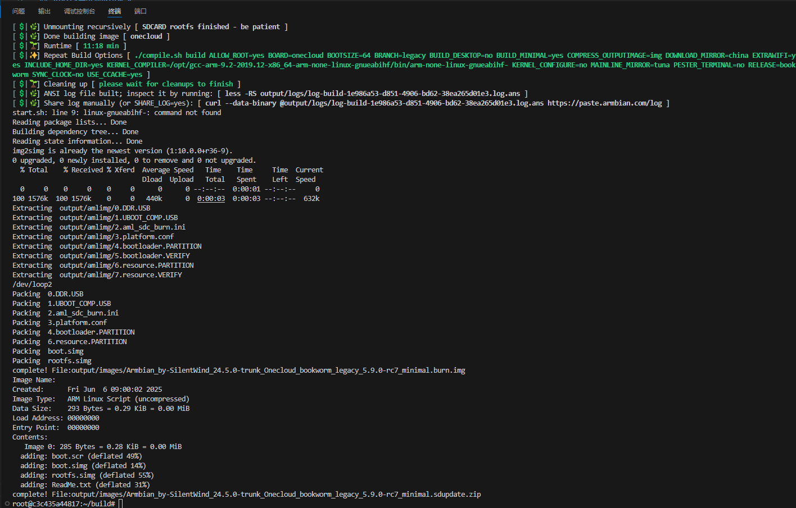

<h3 align=center><br></h3>
<h3 align=center><a href="https://github.com/mofeng-git/Build-Armbian/blob/master/README.md">简体中文</a>
<p align=right>&nbsp;</p>

## 这个项目是做什么的？

- Fork自 [Build-Armbian Leo357449107](https://github.com/Leo357449107/Build-Armbian/tree/20.11)，为玩客云构建基于 Debian 的定制 Linux 系统；
- 包括根文件系统生成、内核映像编译、和引导加载程序编译和镜像打包的全流程支持；
- 构建OTG功能可用的能长期稳定运行的玩客云Armbain镜像（5.9.0-rc7-legacy-meson内核），为PiKVM（One-KVM）提供基础系统支持。


## 如何构建Armbain系统？

>编译好的镜像不会在此处发布， 基础镜像与One-KVM镜像将会在[One-KVM](https://github.com/mofeng-git/One-KVM) release页发布。

**本机构建**

- Ubuntu 22.04 x64（虚拟机或实体机），至少 2GB 内存和 35GB 磁盘空间，用于本机构建，且已配置好sudo 或 root 访问权限；
- 如您希望在中国大陆的主机上进行编译，还需配置好网络代理以便脚本能正确从Github上获取所需其他编译资源。

```bash
git clone --depth=1 --branch=main https://github.com/armbian/build
cd build
#编译玩客云 Armian U盘/SD卡镜像
#需手动配置gcc-arm-9.2-2019.12-x86_64-arm-none-linux-gnueabihf编译工具
./compile.sh build BOARD=onecloud BRANCH=legacy BUILD_DESKTOP=no BUILD_MINIMAL=yes COMPRESS_OUTPUTIMAGE=img EXTRAWIFI=yes  KERNEL_CONFIGURE=no  DOWNLOAD_MIRROR=china MAINLINE_MIRROR=tuna RELEASE=jammy BOOTSIZE=64  SYNC_CLOCK=no INCLUDE_HOME_DIR=yes  KERNEL_COMPILER=/home/mofeng/code/toolchain/gcc-arm-9.2-2019.12-x86_64-arm-none-linux-gnueabihf/bin/arm-none-linux-gnueabihf-
#打包玩客云线刷镜像和卡刷文件包
./userpatches/burnimg-pack.sh output/images/Armbian_by-SilentWind_24.5.0-trunk_Onecloud_jammy_legacy_5.9.0-rc7_minimal.img
```

**Docker 构建**

镜像内包含所有依赖，源代码和构建缓存，可快速构建镜像。

```bash
#手动导入 onecloud_armbian_build 容器
docker run -itd --name onecloud_armbian_build --privileged -v /dev:/dev onecloud_armbian_build bash
docker exec -it onecloud_armbian_build bash
#进入容器后
cd /root/build
bash start.sh
```


One-KVM的预装命令在./userpatches/customize-image.sh，可根据需要进行修改。


## 其他
**参考文档**
- [Development-Code_Review_Procedures_and_Guidelines](https://docs.armbian.com/Development-Code_Review_Procedures_and_Guidelines/)

**致谢**

感谢**观棋不语٩ ི۶**进行初始可行性实验、**0蓝蓝0**全过程提供的指导、群友的测试和建议、各位网友的讨论交流和下列开源项目。
- [Build-Armbian Leo357449107](https://github.com/Leo357449107/Build-Armbian/tree/20.11)
- [armbian-build](https://github.com/armbian/build)
- [armbian-onecloud](https://github.com/hzyitc/armbian-onecloud)
- [Fruity PiKVM](https://github.com/jacobbar/fruity-pikvm)
- [Open and inexpensive DIY IP-KVM based on Raspberry Pi](https://github.com/pikvm/pikvm)

